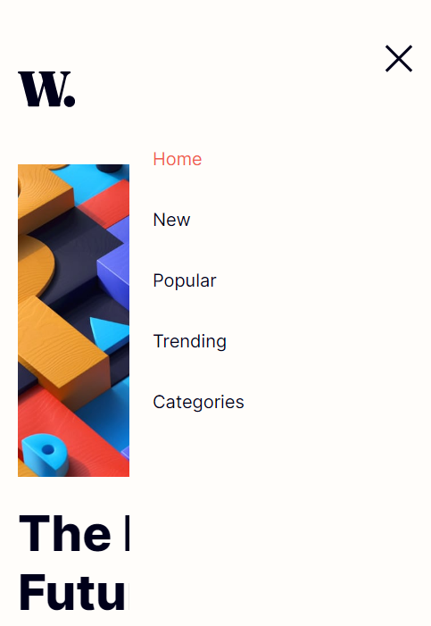

# Frontend Mentor - News homepage solution

This is a solution to the [News homepage challenge on Frontend Mentor](https://www.frontendmentor.io/challenges/news-homepage-H6SWTa1MFl). Frontend Mentor challenges help you improve your coding skills by building realistic projects. 

## Table of contents

- [Overview](#overview)
  - [Screenshot](#screenshot)
- [My process](#my-process)
  - [Built with](#built-with)
- [Author](#author)

### Screenshot
 # Desktop View
  
 # Mobile View
  
 # Mobile Menu
  

## My process

### Built with

- HTML5 
- CSS3
- JavaScript
- CSS Grid
- Responsive Design

## Author
- Github - [Hayama7](https://github.com/Hayama7)
- Frontend Mentor - [@Hayama7](https://www.frontendmentor.io/profile/Hayama7)
